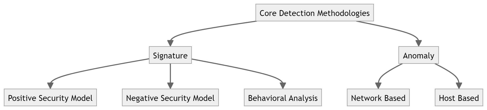
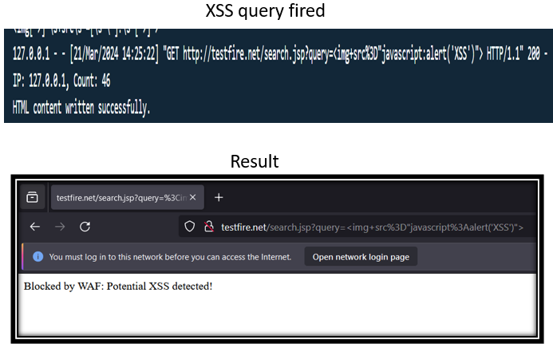

# WebApp-Firewall
A security mechanism desgined to protect OSI Model top layers using Rule and Signature Based Detection and Prevention.
Web applications constantly face new security challenges, including zero-day attacks and cleverly disguised malicious code. WAFs must employ both signature-based detection for known threats and anomaly-based approaches to identify unusual activity patterns, providing comprehensive security.
Denial-of-Service (DoS) and Distributed DoS (DDoS) attacks aim to overload web applications, hindering legitimate user access. WAFs defend against these attacks while also filtering out malicious client-side activity, fostering user trust and safeguarding application responsiveness.

The Library requirements for the Project includes:
1. Flask using pip(no version constraints).
2. Nginx, Apache Server for Reverse Proxy integration and Load Balancing.
3. Burp-Suite for collecting data for Model training.
4. Statistical Analysis tools to gather signatures for known attacks.

